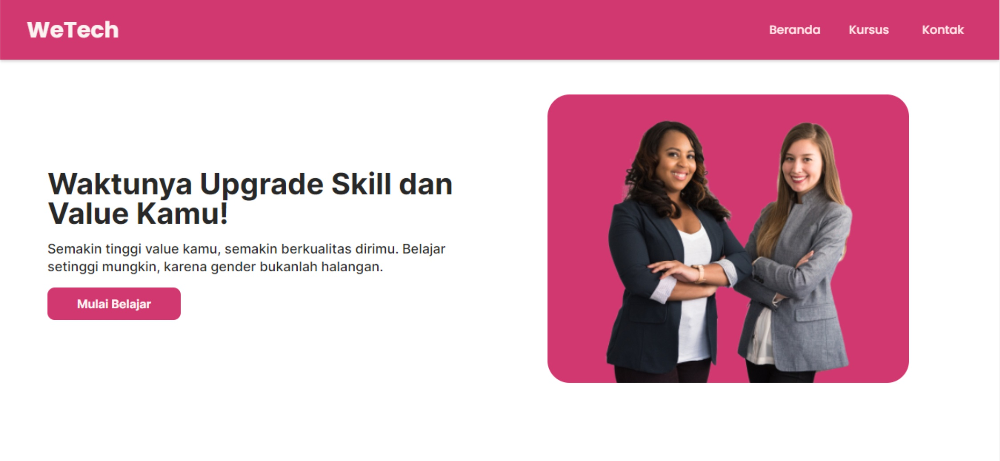
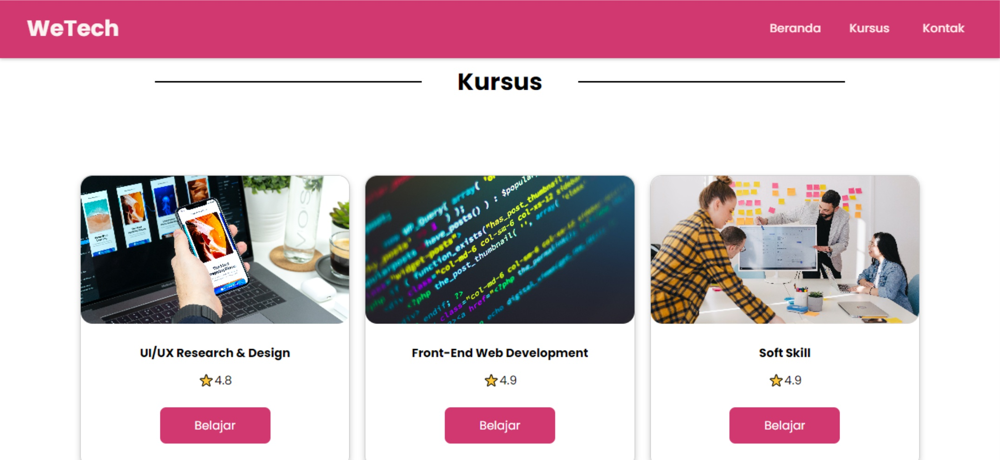
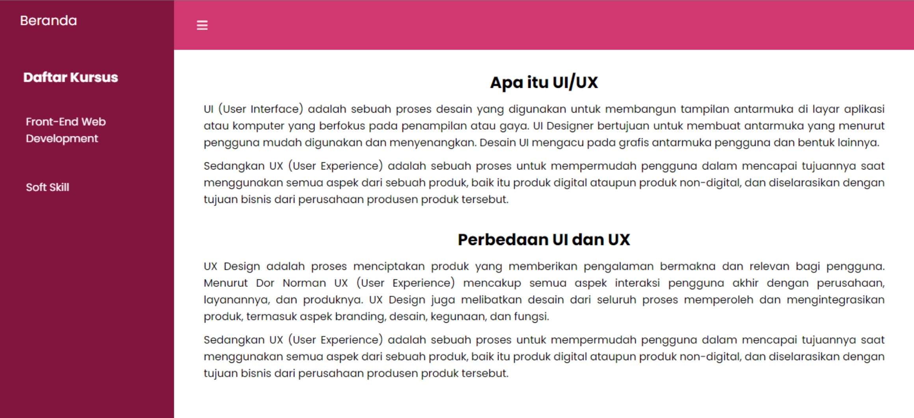
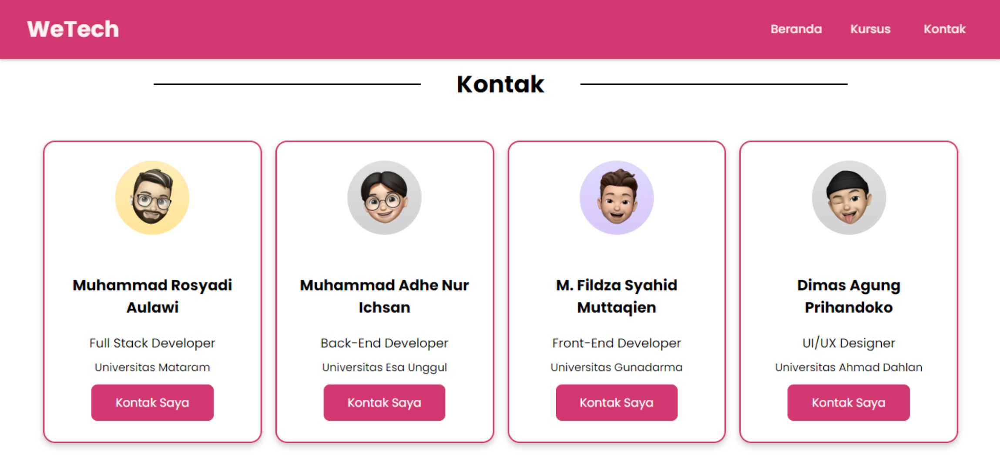

# WeTech App
---
### `Introduction`
WeTech (Women in Technology) is a solution to solve the problem of Gap Gender Inclusivity which created with the aim of inviting people, especially women to improve self-quality
in Technology with providing free learning access content.

### `Feature`

---

| Feature                                 | Completed?         |
|-----------------------------------------| ------------------ |
| Home                                    | :heavy_check_mark: |
| Courses (UI/UX, Front End, SoftSkill)   | :heavy_check_mark: |
| Contact                                 | :heavy_check_mark: |

### Result Of this Project

1. **Home**
   
   

2. **Courses**
   
   

3. **Course Page**
   
   

4. **Contact**
   
   

## Deployment Result

---

[WeTech App](https://capstone-wetech.netlify.app/)
